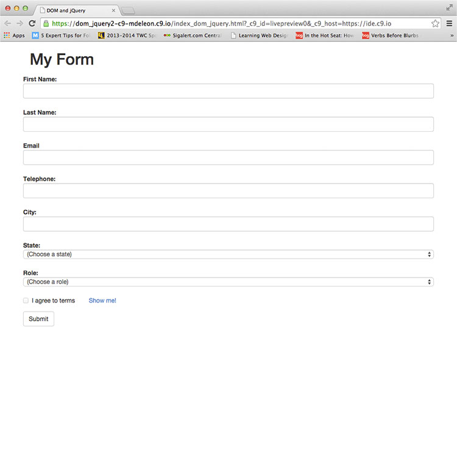

  
`School Work - Advanced Web Design Class - ITI-323`  

# Dates:  
2013 - 2014  
# Technologies:  
Cloud9, HTML5, CSS3, Bootstrap 3, jQuery  
# Description:  
This assignment is showing form validation using jQuery and DOM manipulation.  The site was created with HTML5, CSS3, Bootstrap 3 and jQuery in [Cloud9 - https://c9.io](https://c9.io/).  
# Screenshots:
  

  

  
